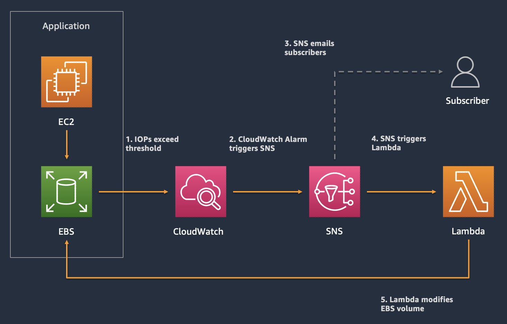

# EBS scaling using Lambda and CloudWatch Alarms

This repository contains files that deploy a solution to automatically scale EBS Volume provisioned IOPS using CloudWatch Alarms and Lambda.
There are 2 files:
1. `lambda_function.py` - this python file contains code that takes input from an SNS topic and modifies 1/ the provisioned IOPS of an EBS Volume in-Alarm, and 2/ the IOPS threshold for the CloudWatch alarm.
2. `ebs-scaling-cfn.json` - this template deploys an EC2 instance, an EBS volume attached to the instance, an SNS topic and a CloudWatch Alarm that sets a threshold on the IOPS made to the EBS volume. Note that you would need to deploy the Lambda function in your AWS environment before you may launch this template. 

## Architecture

## Disclaimer

**This project is used for demo purposes only and should NOT be considered for production use.**